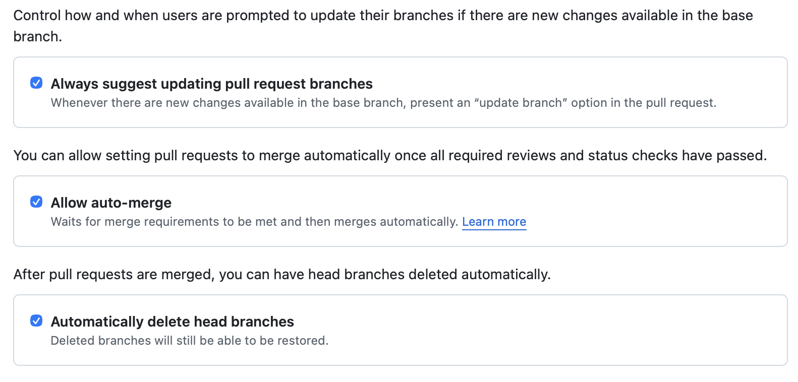
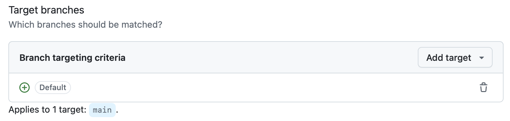
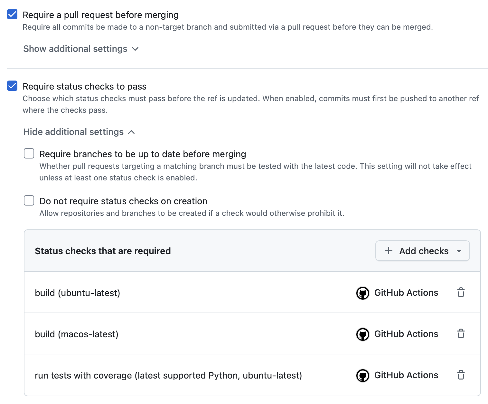

======================================
Recommended GitHub Repository Settings
======================================

Settings for your GitHub repository will be in the ``Settings`` tab.

General
-------

Some useful settings to enable in ``General`` settings:

- ``Always suggest updating pull request branches``
- ``Allow auto-merge``
- ``Automatically delete head branches``

Rules
-----

To protect branches from accidental or unauthorized pushes or changes,
create a new ``Ruleset`` (``Settings`` -> ``Rules`` -> ``Rulesets``)

Ensure that the ruleset covers the default branch in ``Target branches``:

Also enable the following options:

- ``Require a pull request before merging``
- ``Require status checks to pass``
	- ``build (ubuntu-latest)``
	- ``build (macos-latest)``
	- ``run tests with coverage (latest supported Python, ubuntu-latest)``

